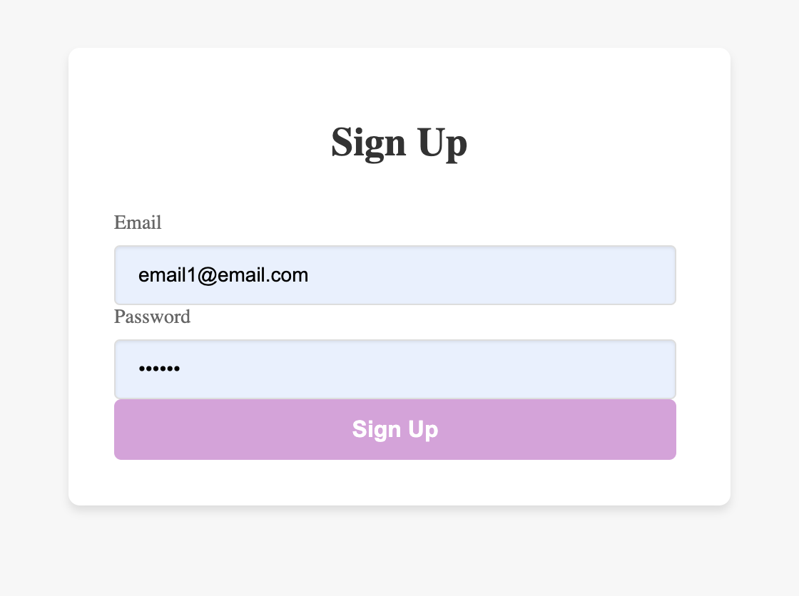
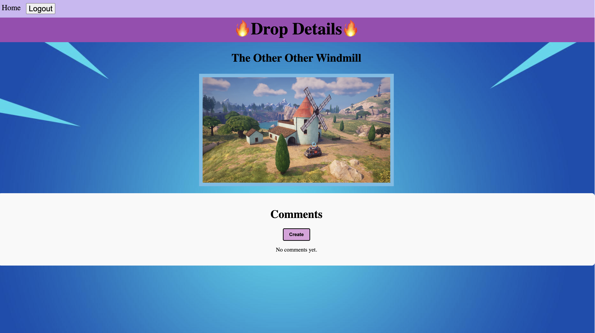
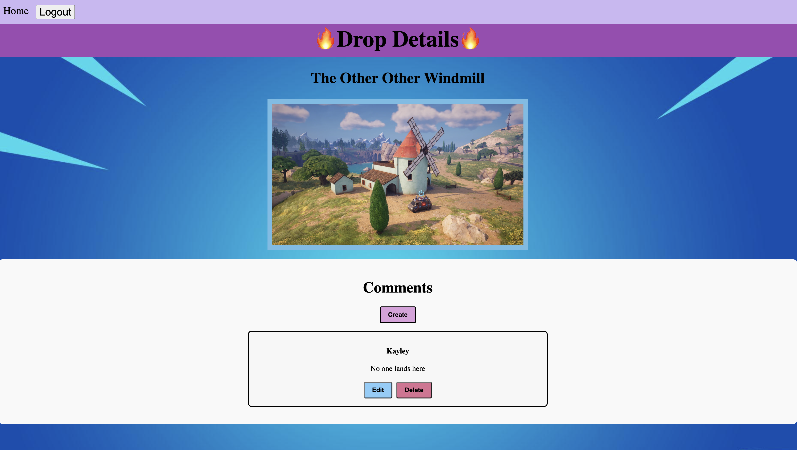
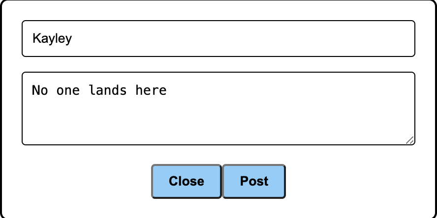

# Drop-In-Like-It-s-Hot

## 📷 Screenshots 📷

Home Page

 
The Home Page consists of rows/columns of the named locations in Fortnite. You can browse through, and when you see one you like, click on it to see the details. To leave a comment, login or sign up so people can see your opinion on your latest drop!

Log In/Sign Up

 
Log In or Sign Up to leave comments on any drop location!

Detail Page

 
The Details Page shows an image of the location and the name of it. You can view comments that have been left by other users to see if that is where you will drop next!

Comments

 
Click the create button to share what you have to say! After posting, you can edit or delete your own.

Editing a Comment

 
Changed your mind about the location? Edit your comment to leave a different message!

## 🖥️ Technologies Used 🖥️

## Installation Instructions

Follow these steps to install and run the project on your local machine.
Make sure you have [Node.js](https://nodejs.org/) and [npm](https://www.npmjs.com/) installed on your computer.
<ul>
    <li>git clone https://github.com/kkincheloe/Drop-In-Like-It-s-Hot</li>
    <li>cd drop-in-like-its-hot</li>
    <li>npm install</li>
    <li>create a .env file at the root of the repository and add the following:</li>
    <li>DB_URI=mongodb://localhost:27017/yourdatabase</li>
    <li>SECRET_KEY=yoursecretkey</li>
    <li>Replace "yourdatabase" with the name of your databse, and replace "your secret key" with the secret key provided for you on MongoDB</li>
    <li>run "npm start" to start the server</li>
    <li>navigate to your browser and type "localhost:3000" and the project should be running!
</ul>

## 📝 User Stories 📝
<ul>-As a user, I want to be able to see what locations of the map are super crowded, so I can avoid them.</ul>
<ul>-As a user, I want to be able to leave a comment to let people know the popularity of where I last landed.</ul>
<ul>-As a user, I want to be able to edit my comment in case the popularity changes!</ul>
<ul>-As a user, I want to be able to search for a location instead of scrolling.</ul>

## ⚠️ Major Hurdles/ Unsolved Problems ⚠️
<li>Getting my comments to post</li>
<li>Creating a hamburger menu for small devices</li>

## 🪜 Next Steps 🪜
<li>Make the "edit" and "delete" buttons not appear if it is not your comment</li>
<li>Make a hamburger menu for smaller devices</li>
